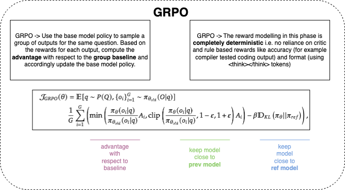

# DeepSeekR1-Zero



This repository implements DeepSeekR1-Zero’s algorithm using GRPO training on the GoEmotions dataset with chain-of-thought reasoning. In this demo, we fine-tune a causal language model (`distilgpt2`) so that it learns to output a chain-of-thought followed by a final answer in a prescribed format. The training leverages a custom reward function that gives a reward of 1.0 if the model’s answer (extracted from `<answer>...</answer>`) matches the ground truth emotion.

Inspired by Karpathy’s minimalist and clear coding style, the repository is organized as follows:

```
DeepSeekR1-Zero/
├── README.md            # This file
├── requirements.txt     # Python dependencies
├── train.py             # Training script (data loading, model fine-tuning, saving)
├── inference.py         # Inference script for testing the fine-tuned model
└── utils.py             # Utility functions (data preprocessing, reward function, model wrapper)
```

## Installation

1. **Clone the repository:**
   ```bash
   git clone https://github.com/yourusername/DeepSeekR1-Zero.git
   cd DeepSeekR1-Zero
   ```

2. **Create a virtual environment and install dependencies:**
   ```bash
   python -m venv venv
   source venv/bin/activate         # On Windows: venv\Scripts\activate
   pip install -r requirements.txt
   ```

## Training

Run the training script:
```bash
python train.py
```
This script will:
- Load a small subset of the [GoEmotions dataset](https://huggingface.co/datasets/go_emotions).
- Preprocess the dataset to create prompts that ask the model to think step-by-step before providing an answer.
- Configure and run the GRPO trainer with a custom reward function.
- Save the fine-tuned model and tokenizer.

## Inference

After training, run the inference script to test the model:
```bash
python inference.py
```
This script loads the fine-tuned model and generates a completion on a test prompt.
